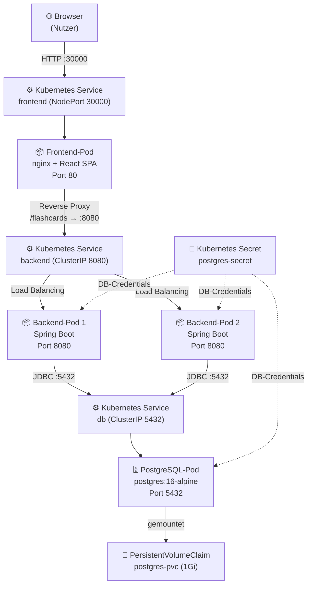

# Architektur – Lernkarten-App

## Architekturdiagramm



## Komponentenverantwortlichkeiten

### Frontend (nginx + React SPA)
- Liefert die statische React-Anwendung an den Browser aus
- Fungiert als **Reverse Proxy** für alle API-Anfragen an `/flashcards`
- Der Browser kommuniziert **niemals direkt** mit dem Backend – alle Anfragen gehen durch nginx
- Dadurch sind CORS-Probleme im Kubernetes-Betrieb irrelevant

### Backend (Spring Boot)
- Stellt die REST-API unter `/flashcards` bereit (CRUD + Lernstatus)
- Verwaltet die Datenbankverbindung via Spring Data JPA / Hibernate
- Enthält keine persistenten Daten – ist vollständig **zustandslos**
- Läuft mit **2 Replikas** für Lastverteilung und Ausfallsicherheit
- Exponiert `/actuator/health` für Kubernetes Probes

### PostgreSQL (Datenbank)
- Einzige zustandsbehaftete Komponente der Architektur
- Speichert alle Flashcards persistent im `PersistentVolumeClaim`
- Läuft als einzelner Pod (1 Replica) – horizontale Skalierung einer einzelnen PG-Instanz ist ohne Replikationssetup nicht sinnvoll

---

## Warum PostgreSQL persistent gespeichert wird

Container und Pods sind **ephemer** (kurzlebig). Wird ein Pod gelöscht, neugestartet oder auf einen anderen Node verschoben, gehen alle lokalen Daten verloren.

Kubernetes löst das mit einem **PersistentVolumeClaim (PVC)**:
- Der PVC reserviert Speicher aus einem PersistentVolume (vom Cluster bereitgestellt)
- Der Speicher lebt **unabhängig vom Pod-Lebenszyklus**
- Wird der PostgreSQL-Pod neu gestartet, mountet der neue Pod denselben PVC
- Alle Flashcards bleiben erhalten

```
Pod (kurzlebig)  ←→  PVC (langlebig)  ←→  PersistentVolume (Cluster-Speicher)
```

Das `subPath: pgdata` im VolumeMount verhindert außerdem Berechtigungsprobleme, die auftreten, wenn PostgreSQL ein bereits existierendes, nicht-leeres Verzeichnis mountet.

---

## Wie Backend-Skalierung funktioniert

Das Backend-Deployment ist mit `replicas: 2` konfiguriert:

```
[Browser] → [nginx] → [backend Service (ClusterIP)]
                              ↓ kube-proxy load balancing
                    [Backend-Pod 1]   [Backend-Pod 2]
                          ↕                   ↕
                    [PostgreSQL (gemeinsam)]
```

1. Der **Kubernetes Service** `backend` ist ein virtueller Load Balancer (ClusterIP)
2. `kube-proxy` verteilt eingehende Anfragen auf alle gesunden Pods (Round-Robin)
3. Beide Pods verbinden sich zur **gleichen PostgreSQL-Instanz** – kein geteilter Zustand im Pod selbst
4. Das Backend ist dadurch **horizontal skalierbar**: `kubectl scale deployment backend --replicas=3`

---

## Readiness Probe und Liveness Probe

### Startup Probe
```yaml
startupProbe:
  httpGet:
    path: /actuator/health/liveness
    port: 8080
  initialDelaySeconds: 10
  periodSeconds: 10
  failureThreshold: 12   # max. 120 Sekunden Startzeit
```
Gibt dem Backend bis zu 120 Sekunden Zeit zum Hochfahren. Erst danach greifen Liveness und Readiness Probe.

### Readiness Probe – „Bin ich bereit für Traffic?"
```yaml
readinessProbe:
  httpGet:
    path: /actuator/health/readiness
    port: 8080
  periodSeconds: 10
```
- Schlägt fehl → Pod wird aus dem Service-LoadBalancer entfernt (kein Traffic)
- Springt an → Pod wird wieder hinzugefügt
- Typischer Auslöser: Datenbankverbindung verloren

### Liveness Probe – „Lebe ich noch?"
```yaml
livenessProbe:
  httpGet:
    path: /actuator/health/liveness
    port: 8080
  periodSeconds: 15
```
- Schlägt fehl → Kubernetes **tötet** den Pod und startet ihn neu
- Typischer Auslöser: Deadlock, OutOfMemory, hängender Thread

Spring Boot aktiviert diese Sub-Pfade über:
```properties
management.endpoint.health.probes.enabled=true
```

---

## Secrets und Umgebungsvariablen

### Warum Secrets?
- Passwörter dürfen **nicht im Klartext** in YAML-Dateien stehen
- YAML-Dateien werden in Git eingecheckt → Passwort wäre öffentlich
- Kubernetes Secrets werden base64-kodiert gespeichert und können mit RBAC geschützt werden

### Aufbau
```
k8s/secret.yaml  →  postgres-secret  →  POSTGRES_PASSWORD, POSTGRES_USER, POSTGRES_DB
                                               ↓                        ↓
                                    PostgreSQL-Pod (env)    Backend-Pod (env via secretKeyRef)
```

Der Backend-Pod referenziert das Secret so:
```yaml
env:
  - name: SPRING_DATASOURCE_PASSWORD
    valueFrom:
      secretKeyRef:
        name: postgres-secret
        key: POSTGRES_PASSWORD
```

Spring Boot liest die Umgebungsvariablen automatisch als Property-Overrides:
`SPRING_DATASOURCE_PASSWORD` → `spring.datasource.password`

---

## Ausfallszenarien und Verhalten

### Szenario 1: Backend-Pod wird manuell gelöscht

```bash
kubectl delete pod -l app=backend -n flashcards --wait=false
```

**Was passiert:**
1. Kubernetes erkennt, dass die Anzahl der laufenden Pods unter `replicas: 2` fällt
2. Kubernetes startet sofort einen neuen Pod
3. Während des Neustarts leitet der Service Traffic nur an den verbleibenden gesunden Pod
4. Der neue Pod besteht Startup → Readiness Probe → wird zum Service hinzugefügt
5. Kein Datenverlust, da alle Daten in PostgreSQL persistiert sind

**Demo-Befehl:**
```bash
# Pod löschen
kubectl delete pod $(kubectl get pod -n flashcards -l app=backend -o name | head -1) -n flashcards

# Sofort beobachten wie neuer Pod hochkommt
kubectl get pods -n flashcards -w
```

### Szenario 2: Backend ist nicht erreichbar (Datenbankausfall)

- Readiness Probe schlägt fehl → Backend-Pods werden aus dem LoadBalancer entfernt
- Frontend zeigt Netzwerkfehler (kein Proxy-Ziel verfügbar)
- Sobald Datenbank wieder verfügbar → Readiness Probe erfolgreich → Pods wieder aktiv

### Szenario 3: PostgreSQL-Pod wird gelöscht

- Pod wird von Kubernetes neu gestartet
- PVC bleibt erhalten → alle Daten sind nach dem Neustart wieder vorhanden
- Backend-Pods verlieren kurz die DB-Verbindung, werden durch Readiness Probe aus Service entfernt
- Nach PostgreSQL-Neustart: Verbindung wird wiederhergestellt, Readiness Probes erfolgreich
